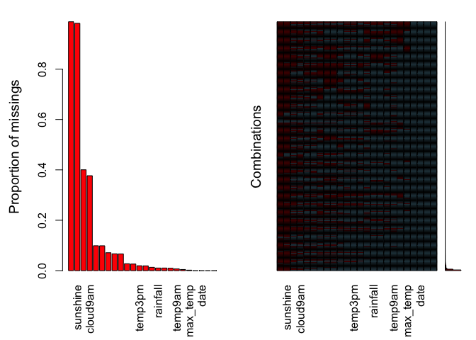
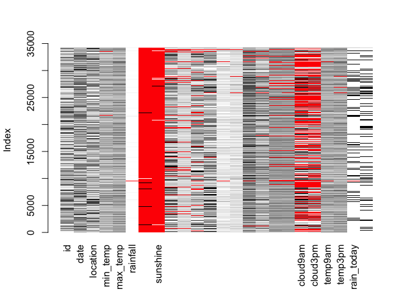
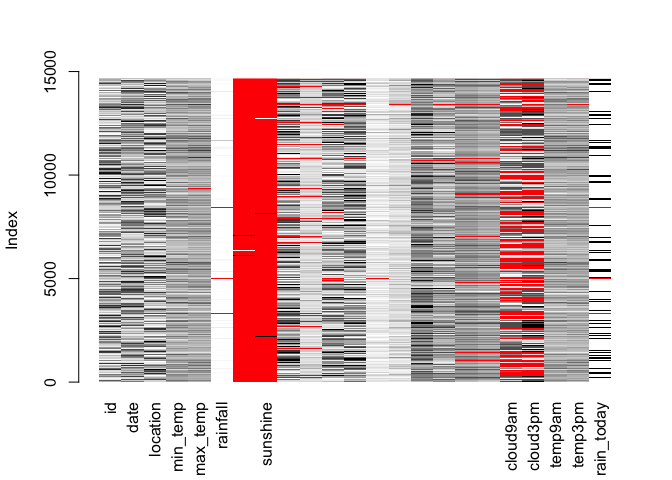
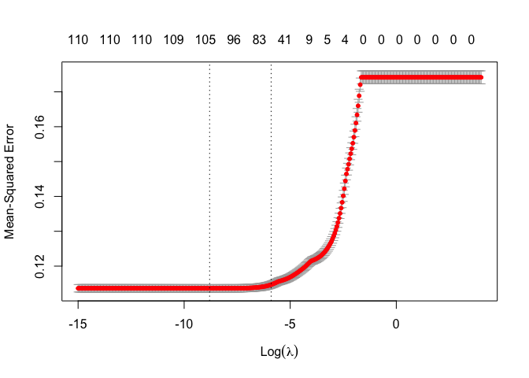

Will it rain tomorrow in Australia?
================

This is a walk through of fitting a LASSO model. I also fit a GBM model
for this data, but to keep this from getting too long I will only
include the first method. Please see repo for both models.

## Data

This is a former Kaggle contest and was one of my projects in school.
The data consists of various measurements such as temp and humidity from
weather stations. Additionally, there are rain today and rain tomorrow
columns. The goal is to train a model to predict if it will rain
tomorrow on the test data.

``` r
library(tidyverse)
library(mice)
library(VIM)
library(caret)
library(glmnet)
library(gbm)

train<- read_csv("train.csv")
test <- read_csv("test.csv")
```

After initially opening the csv of the training set, I could see a
number of NA values. This will be a problem when trying to implement a
lot of the models, so we will need to see what we are dealing with in
that regard.

``` r
aggr(train, labels = names(train), sortVars = TRUE)
```

<!-- -->

    ## 
    ##  Variables sorted by number of missings: 
    ##         Variable       Count
    ##      evaporation 0.987833055
    ##         sunshine 0.981720336
    ##         cloud3pm 0.400339271
    ##         cloud9am 0.376882805
    ##      pressure9am 0.098885672
    ##      pressure3pm 0.098739434
    ##      wind_dir9am 0.071129829
    ##    wind_gust_dir 0.066830452
    ##  wind_gust_speed 0.066420988
    ##      wind_dir3pm 0.027521862
    ##      humidity3pm 0.026234974
    ##          temp3pm 0.019478810
    ##    wind_speed3pm 0.019010851
    ##      humidity9am 0.013249101
    ##         rainfall 0.010441344
    ##       rain_today 0.010441344
    ##    wind_speed9am 0.009593168
    ##          temp9am 0.006814659
    ##         min_temp 0.004591852
    ##         max_temp 0.002047322
    ##               id 0.000000000
    ##             date 0.000000000
    ##         location 0.000000000
    ##    rain_tomorrow 0.000000000

``` r
matrixplot(train)
```

<!-- -->

    ## 
    ## Click in a column to sort by the corresponding variable.
    ## To regain use of the VIM GUI and the R console, click outside the plot region.

``` r
matrixplot(test)
```

<!-- -->

    ## 
    ## Click in a column to sort by the corresponding variable.
    ## To regain use of the VIM GUI and the R console, click outside the plot region.

evaporatin and sunshine are almost entirely missing. Data for clouds are
also missing a fair amount, but not nearly as much as the first two
features.

Will need to adjust some of the columns before doing any kind of
imputation. For the purpose of this project, I removed evaporation and
sunshine.

``` r
train <- train %>% 
  mutate(across(where(is.character), factor)) %>% 
  select(-evaporation, -sunshine)

test <- test %>% 
  mutate(across(where(is.character), factor)) %>% 
  select(-evaporation, -sunshine)
```

## Imputation of missing values

Now lets impute that missing data using the mice package (FYI this takes
a while to run).

``` r
set.seed(100)
mids <- mice(train,
             m = 1,
             nnet.MaxNWts = 1800,
             seed = 1133)
```

    ## 
    ##  iter imp variable
    ##   1   1  min_temp  max_temp  rainfall  wind_gust_dir  wind_gust_speed  wind_dir9am  wind_dir3pm  wind_speed9am  wind_speed3pm  humidity9am  humidity3pm  pressure9am  pressure3pm  cloud9am  cloud3pm  temp9am  temp3pm  rain_today
    ##   2   1  min_temp  max_temp  rainfall  wind_gust_dir  wind_gust_speed  wind_dir9am  wind_dir3pm  wind_speed9am  wind_speed3pm  humidity9am  humidity3pm  pressure9am  pressure3pm  cloud9am  cloud3pm  temp9am  temp3pm  rain_today
    ##   3   1  min_temp  max_temp  rainfall  wind_gust_dir  wind_gust_speed  wind_dir9am  wind_dir3pm  wind_speed9am  wind_speed3pm  humidity9am  humidity3pm  pressure9am  pressure3pm  cloud9am  cloud3pm  temp9am  temp3pm  rain_today
    ##   4   1  min_temp  max_temp  rainfall  wind_gust_dir  wind_gust_speed  wind_dir9am  wind_dir3pm  wind_speed9am  wind_speed3pm  humidity9am  humidity3pm  pressure9am  pressure3pm  cloud9am  cloud3pm  temp9am  temp3pm  rain_today
    ##   5   1  min_temp  max_temp  rainfall  wind_gust_dir  wind_gust_speed  wind_dir9am  wind_dir3pm  wind_speed9am  wind_speed3pm  humidity9am  humidity3pm  pressure9am  pressure3pm  cloud9am  cloud3pm  temp9am  temp3pm  rain_today

    ## Warning: Number of logged events: 30

``` r
comp <- complete(mids, 1)

set.seed(1234)
midstest <- mice(test,
                 m = 1,
                 nnet.MaxNWts = 1800,
                 seed = 1122)
```

    ## 
    ##  iter imp variable
    ##   1   1  min_temp  max_temp  rainfall  wind_gust_dir  wind_gust_speed  wind_dir9am  wind_dir3pm  wind_speed9am  wind_speed3pm  humidity9am  humidity3pm  pressure9am  pressure3pm  cloud9am  cloud3pm  temp9am  temp3pm  rain_today
    ##   2   1  min_temp  max_temp  rainfall  wind_gust_dir  wind_gust_speed  wind_dir9am  wind_dir3pm  wind_speed9am  wind_speed3pm  humidity9am  humidity3pm  pressure9am  pressure3pm  cloud9am  cloud3pm  temp9am  temp3pm  rain_today
    ##   3   1  min_temp  max_temp  rainfall  wind_gust_dir  wind_gust_speed  wind_dir9am  wind_dir3pm  wind_speed9am  wind_speed3pm  humidity9am  humidity3pm  pressure9am  pressure3pm  cloud9am  cloud3pm  temp9am  temp3pm  rain_today
    ##   4   1  min_temp  max_temp  rainfall  wind_gust_dir  wind_gust_speed  wind_dir9am  wind_dir3pm  wind_speed9am  wind_speed3pm  humidity9am  humidity3pm  pressure9am  pressure3pm  cloud9am  cloud3pm  temp9am  temp3pm  rain_today
    ##   5   1  min_temp  max_temp  rainfall  wind_gust_dir  wind_gust_speed  wind_dir9am  wind_dir3pm  wind_speed9am  wind_speed3pm  humidity9am  humidity3pm  pressure9am  pressure3pm  cloud9am  cloud3pm  temp9am  temp3pm  rain_today

    ## Warning: Number of logged events: 30

``` r
imptest <- complete(midstest, 1)
```

## LASSO model

So we have a complete data set finally, now we can build a model. (LASSO
first)

First I will partition the training data into a 75/25 training/test
split for cross validation.

``` r
set.seed(222)
trainindex <- createDataPartition(comp$rain_tomorrow, p = 0.75, list = FALSE)
comptrain <- comp[trainindex,]
comptest <- comp[-trainindex,]
```

Next, the data needs to be in matrix format to be used in the LASSO
model.

``` r
xtrain <- model.matrix(rain_tomorrow ~ ., data = comptrain)[,-1]
xtest <- model.matrix(rain_tomorrow ~ ., data = comptest)[,-1]
ytrain <- comptrain$rain_tomorrow
ytest <- comptest$rain_tomorrow
```

Cross validation to find best lambda value

``` r
lam <- exp(seq(-15, 4, .05))

set.seed(123)
lassocv <- cv.glmnet(xtrain, ytrain, alpha = 1, lambda = lam)
plot(lassocv)
```

<!-- -->

Fitting the model with the best lambda from CV on the training data, and
using that model to generate predictions on the test data (from cross
validation split).

``` r
lassomod <- glmnet(xtrain, as.factor(ytrain), alpha = 1, 
                   lambda = lassocv$lambda.min,
                   family = "binomial")

lassopred <- predict(lassomod, s = lassocv$lambda.min, newx = xtest,
                     type = "response")
```

Calculating log loss (I found the ML metrics package after I wrote my
own calc)

``` r
log_loss_calc <- function(preds, actual) {
  loss <- -((actual*log(preds)) + ((1-actual)*log(1-preds)))
  total <- sum(loss) / nrow(preds)
  return(total)
}

log_loss_calc(lassopred, ytest)
```

    ## [1] 0.3445667

``` r
MLmetrics::LogLoss(lassopred, ytest)
```

    ## [1] 0.3445667

Lastly, it is time to fit the model on the test data, predict responses,
and create a csv for submission.

``` r
imptest$hat <- 0
testmat <- model.matrix(hat ~ ., data = imptest)[,-1]

yhattest <- predict(lassomod, s = lassocv$lambda.min, newx = testmat,
                    type = "response")

out <- data.frame(imptest$id, yhattest)
names(out)[1] <- "id"
names(out)[2] <- "rain_tomorrow"

#write_csv(out, "rainsubmitlasso.csv")
```

My final logloss score on the test data for the LASSO was 0.36655 and my
final score for the GBM was 0.36558. Seems fairly close, especially
considering how long it takes to run the GBM model.
